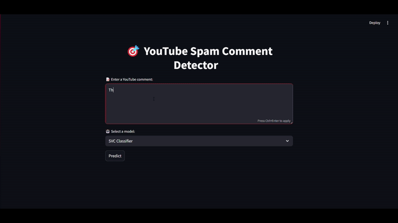

# 🎯 YouTube Spam Comment Detector

A **Streamlit web application** that detects whether a YouTube comment is **spam** or **ham (not spam)** using multiple trained machine learning models.

---

## 🚀 Demo

Paste a comment, select your preferred model (like Logistic Regression, Naive Bayes, or Random Forest), and instantly get a spam/ham prediction!

---

## 📦 Features

✅ User-friendly Streamlit interface  
✅ Multiple ML models for comparison  
✅ TF-IDF-based text vectorization  
✅ Clean prediction display with emojis  
✅ Easily extendable for other datasets  

---

## 🧠 Models Used

- Logistic Regression
- Gaussian Naive Bayes
- MLP Classifier (Neural Network)
- Support Vector Classifier (SVC)
- Decision Tree Classifier
- Random Forest Classifier
- K-Nearest Neighbors (KNN)
- Voting Classifier (ensemble)

---

## 🖥️ Interface Preview

- 📝 Text area to input a YouTube comment  
- 🔘 Dropdown to choose your ML model  
- 🟢 Result display: `✅ Ham` or `📦 Spam`

---

## 📁 Project Structure
youtube-spam-detector/    
│  
├── app.py                      ← Your Streamlit app  
├── README.md                   ← Optional, description of project  
├── requirements.txt            ← List of Python packages (explained below)  
├── saved_models/               ← Folder with saved model files  
│   ├── tfidf_vectorizer.joblib  
│   ├── lr_model.joblib  
│   └── ... other model files  

